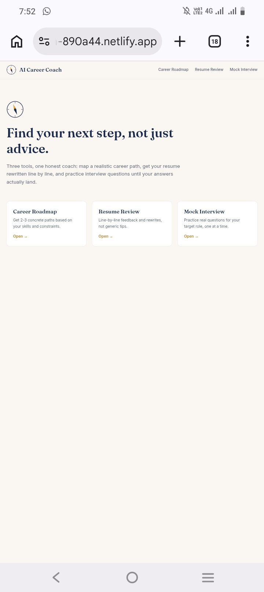
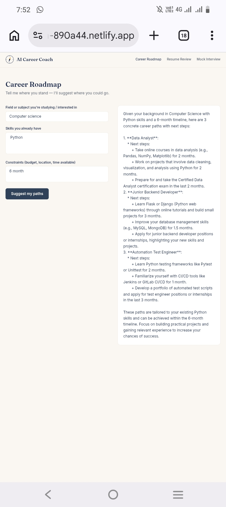
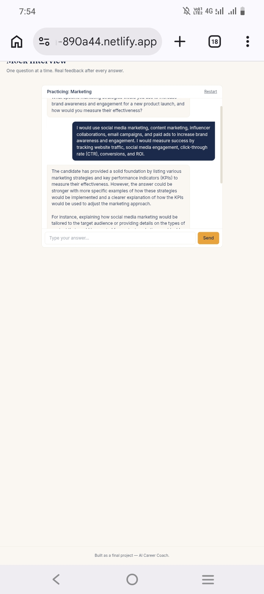
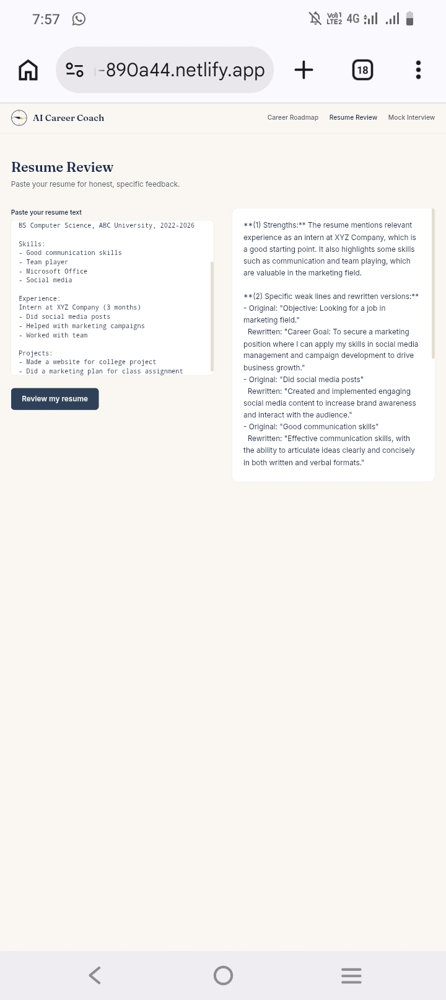

# AI Career Coach

**A free, honest career mentor for students who don't have access to one.**

Many students figure out their career path through guesswork, one generic
YouTube video at a time — no one to review their resume line by line, and no
low-stakes way to practice an interview before the real one. AI Career Coach
is a single web app that gives them all three: a personalized career roadmap,
a real resume review, and a practice interview that actually talks back.

Built for students and early-career professionals who need direction but
don't have a mentor, career office, or paid coach to turn to.

## 🔗 Live App

**[https://dreamy-tulumba-890a44.netlify.app](https://dreamy-tulumba-890a44.netlify.app)**

## ✨ Features

- **Career Roadmap** — enter your field, current skills, and constraints
  (budget, location, time); get 2-3 concrete, realistic career paths with
  next steps, not vague inspiration.
- **Resume Review** — paste your resume text; get strengths, specific weak
  lines quoted and rewritten, and three actionable improvements.
- **Mock Interview** — pick a job role, get asked one realistic interview
  question at a time in a chat interface, receive brief feedback after each
  answer before the next question comes.
- Loading states and friendly error handling if the AI service is slow or
  unavailable.
- Fully responsive, works on mobile and desktop.

## 🤖 The AI Feature

Every tool in this app is powered by the **Groq API** (`llama-3.3-70b-versatile`),
called from a server-side function so the API key is never exposed to the
browser. All three tools share one system instruction:

You are an expert career coach helping students and early-career
professionals. You give honest, specific, actionable advice — never
generic. For resume reviews: point out exact weak lines and rewrite
them. For mock interviews: ask one realistic question at a time, wait
for the answer, then give brief constructive feedback before the next
question. For career roadmaps: use the info given about their skills,
interests, and constraints to suggest 2-3 concrete paths with next
steps. Keep responses focused and not overly long.

Each tool sends a different structured prompt on top of this — see
`netlify/functions/coach.js` for the exact prompts sent per mode.

## 🛠️ Tools, Services & Models Used

- **React + Vite** — frontend framework and build tool
- **Tailwind CSS** — styling
- **Netlify** — hosting and serverless functions
- **Groq API** (`llama-3.3-70b-versatile`) — the AI powering all three
  coaching features
- **Claude (Anthropic)** — used to plan the architecture and write the
  application code

## 📸 Screenshots

## 🚀 How to Run This Project

### Option A — Run it live (already deployed)
Just open the live URL above. No setup needed.

### Option B — Run it locally
1. Clone this repo
2. Run `npm install`
3. Create a `.env` file with `GROQ_API_KEY=your_key_here`
4. Run `npm run dev`

### Deploying your own copy
1. Push this repo to GitHub (public)
2. Import it on [netlify.com](https://netlify.com)
3. Add environment variable `GROQ_API_KEY` in project settings
4. Deploy

## 📁 Project Structure

This project was built as a solo final project. I designed the app idea, features, and AI prompts myself, and used Claude (Anthropic) as a coding assistant to help write and debug the implementation, and to guide me through deployment since I built this entirely from my mobile phone. All architecture decisions, feature choices, and the AI system prompt design are my own.
